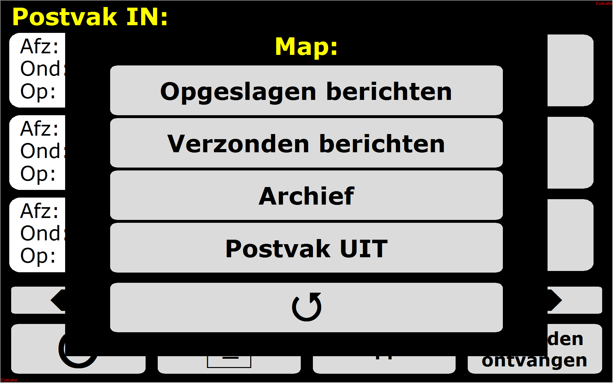

# Tobii Dynavox Communicator 4 page sets

### Main menu

### Keyboard

### Agenda (calls [KiepVisitorRegistration](https://github.com/Joozt/KiepVisitorRegistration) and [KiepAgendaViewer](https://github.com/Joozt/KiepAgendaViewer))

### E-mail

].png)

### Programs (calls [KiepRover](https://github.com/Joozt/KiepRover))

### Photo viewer (calls [KiepPhotoDownloader](https://github.com/Joozt/KiepPhotoDownloader))

### Z-wave (calls [KiepLamp](https://github.com/Joozt/KiepLamp))

### Facebook

### Games (calls [KiepTetris](https://github.com/Joozt/KiepTetris) and [KiepMissileLauncher](https://github.com/Joozt/KiepMissileLauncher))

### Settings (calls [KiepMouseSpeed](https://github.com/Joozt/KiepMouseSpeed))

